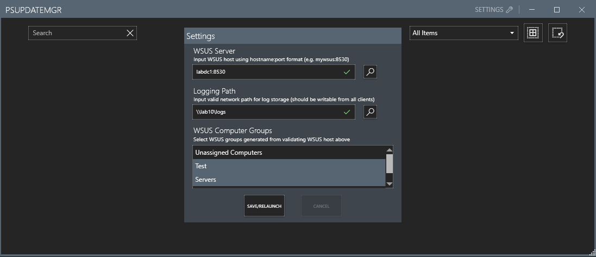
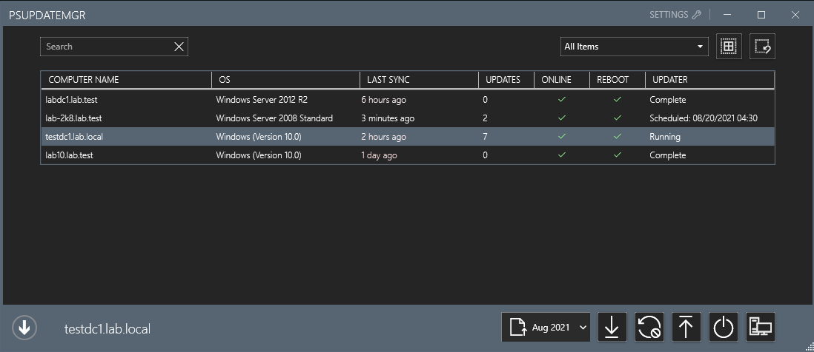
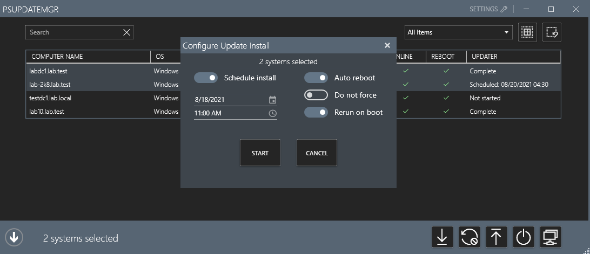
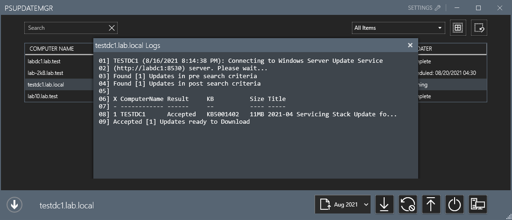

# PSUpdateMgr - GUI for PSWindowsUpdate

A front end for the PSWindowsUpdate module that allows deployment to chosen computer groups from a WSUS server. Fully multithreaded and supports logging and muti-client remote connections using RDCMan.

<b>Usage</b>

Define the WSUS server, logging path, and computer groups to generate a list of clients to monitor.
---

Shows a list of all selected WSUS clients and their state.
---

Allows the immediate or scheduled install of updates, allowing automatic restarts (with repatching upo boot). 
---

Displays all actions as logged. 
---

